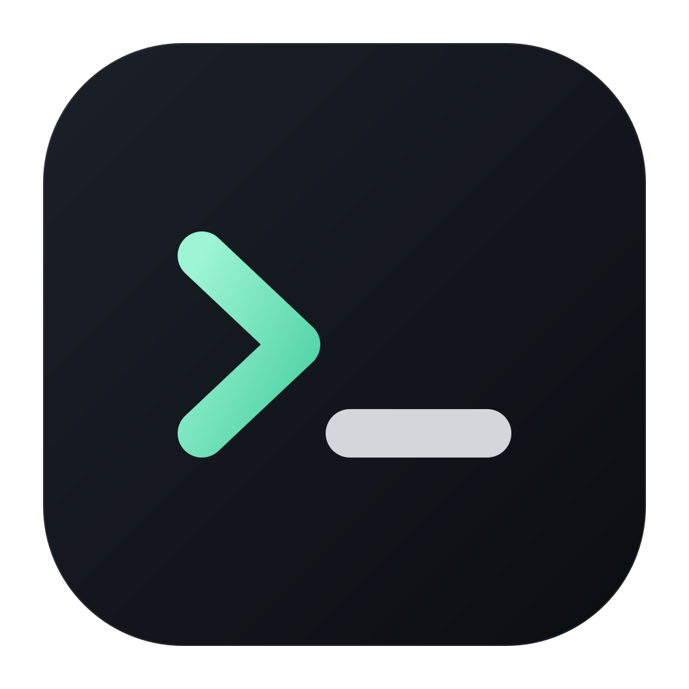
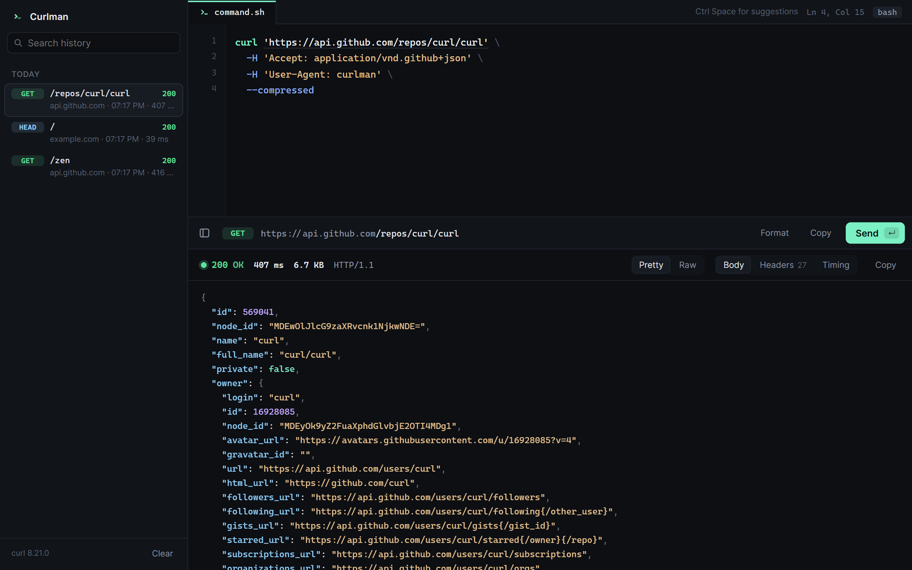

<p align="center">
  
</p>

<h1 align="center">Curlman</h1>

<p align="center">
  A fast, minimal desktop app for running raw cURL commands.<br>
  <b>Paste cURL. Press Enter. Get the response.</b>
</p>

<p align="center">
  
</p>

## Why Curlman

API docs, browser DevTools and teammates all hand you requests as cURL. Most API
clients make you take those commands apart into URL fields, header tables and body
tabs. Curlman doesn't. It reads the command the way a shell does and runs it with
the real `curl` binary, so every flag behaves exactly as it does in your terminal.

- **Raw cURL first.** No forms to fill in. Paste a command, or type a bare URL.
- **Shell-accurate parsing.** Handles bash/zsh quoting, `\` line continuations,
  `$'...'` strings, and Windows `cmd` syntax with `^` escapes. Both of the browser's
  "Copy as cURL" formats work as-is.
- **A real editor.** Syntax highlighting, line numbers, active line, cursor position,
  and one-key formatting between one-line and multi-line.
- **Autocomplete.** Suggests curl flags, methods after `-X`, and header names and
  values after `-H`.
- **Readable responses.** Pretty JSON that keeps large numbers exact, HTML source and
  sandboxed preview, images, headers, and a timing breakdown (DNS, connect, TLS,
  time to first byte, download).
- **History.** Every request is saved locally, grouped by day and searchable.
- **Small and quick.** Built with Tauri and the system WebView: a 3 MB app, about
  1 MB installer, around 25 MB of memory.

## Install

Download the installer from the [Releases](../../releases) page, or build it yourself
(see [Development](#development)).

Curlman uses the `curl` that's already on your system: `%SystemRoot%\System32\curl.exe`
on Windows 10 and later, or `curl` on your `PATH` on macOS and Linux. To use a different
binary, set the `CURLMAN_CURL` environment variable.

## Usage

Paste a command and press **Enter**:

```bash
curl 'https://api.example.com/users' \
  -H 'Authorization: Bearer TOKEN' \
  -H 'Content-Type: application/json' \
  -d '{"name":"John"}'
```

Enter works like a shell. It sends the request, unless the text before the cursor ends
in a line continuation (`\` or `^`) or an open quote. In that case it adds a new line.

### Keyboard shortcuts

| Key | Action |
| --- | --- |
| `Enter` | Send (or add a new line inside a quote or after `\`) |
| `Ctrl/Cmd + Enter` | Send from anywhere |
| `Shift + Enter` | New line |
| `Esc` | Cancel the running request |
| `Ctrl + Space` | Show suggestions |
| `Tab` / `Enter` / `Up` / `Down` | Accept or move through suggestions |
| `Ctrl/Cmd + L` | Focus and select the command |
| `Ctrl/Cmd + Shift + F` | Format: toggle multi-line and one-line |
| `Ctrl/Cmd + B` | Toggle history |
| `Ctrl/Cmd + K` | Search history |
| `Ctrl/Cmd + N` | New request |
| `Ctrl/Cmd + 1` / `2` / `3` | Body / Headers / Timing |
| `Ctrl/Cmd + Shift + C` | Copy the response |

### What Curlman changes in your command

Curlman captures output itself, so it removes flags that would redirect or reshape it:
`-o`, `-O`, `-i`, `-v`, `-s`, `-S`, `-w`, `-D`, `-f`, `--trace` and similar. Every
other flag is passed to curl unchanged.

## Development

Requirements: Node.js 22+, Rust, and the
[Tauri prerequisites](https://tauri.app/start/prerequisites/) for your platform.

```bash
npm install
npm run tauri dev     # desktop app with hot reload
npm run dev           # the same UI in a browser at http://localhost:1420
npm run tauri build   # release app and installer
```

In browser mode the Vite dev server runs curl for the page, so requests work the same
as in the desktop app. Opening `dist/index.html` on its own has no backend, and the app
says so.

Release output:

- App: `src-tauri/target/release/curlman.exe`
- Installer: `src-tauri/target/release/bundle/nsis/Curlman_<version>_x64-setup.exe`

## Tests

```bash
npm test            # parser, highlighters, autocomplete, browser-mode backend
npm run test:rust   # Rust backend: running curl, binary bodies, errors, cancellation
npm run test:e2e    # drives the real UI in the desktop app, browser mode,
                    # and the static bundle without a backend
npm run test:all    # everything, including a release build
```

Tests run against a local HTTP server and don't need internet access. The end-to-end
tests need Chrome or Edge, or `CURLMAN_E2E_BROWSER` pointing at a Chromium-based
browser. The desktop part runs on Windows and needs a release build.

## Project layout

| Path | Purpose |
| --- | --- |
| `src/parse.ts` | Shell tokenizer (bash and cmd), flag handling, formatter |
| `src/suggest.ts` | Context-aware autocomplete |
| `src/highlight.ts` | Editor, JSON and markup highlighting |
| `src/bridge.ts` | Calls the backend through Tauri IPC or the dev server |
| `src/main.ts` | The UI |
| `src-tauri/src/main.rs` | Desktop backend: runs curl, captures headers, body and timing |
| `scripts/dev-bridge.ts` | The same backend for `npm run dev` |
| `scripts/*.test.ts` | Backend and end-to-end tests |
